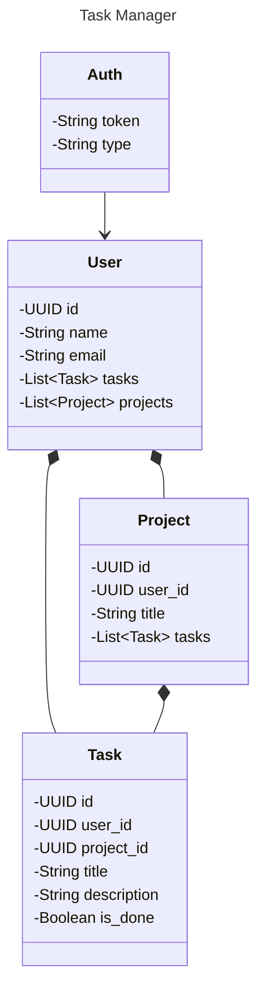

<h1 align="center">Task Manager</h1>

### Description

<p align="center justify">
This repository is a Task Manager project, where the user, through registration and login, can manage the entire task cycle, add, show, update and delete. The user can also group these tasks into a project, for their own organization.
</p>

## BACKEND

<p align="center justify">
Backend developed as a REST API, using PHP with Laravel framework. Containing four endpoints, namely: Task Endpoint, Project Endpoint, User Endpoint (only methods: GET, PUT and DELETE) and Auth Endpoint (POST methods only).
</p>

#### Tech Stack:

    PHP@8.3, Laravel@10, SQLite

#### Class diagram (Main responses):



## Running the app

**Prerequisites:**

-  PHP version 8.3 or higher (Check your version: `php -v`)
-  Composer version 2.7 or higher (Check your version: `composer --version`)

**Commands:**

*If you have npm installed*
```bash
cd backend
npm run start:dev
```
*or*
```bash
cd backend
composer install
cp .env.example .env
php artisan key:generate
php artisan migrate -n
php artisan jwt:secret -f
php artisan l5-swagger:generate
php artisan serve
```

**That's it! Now you can access the app:**

- **home:** `http://127.0.0.1:8000/api`
- **documentation:** `http://127.0.0.1:8000/api/documentation`
